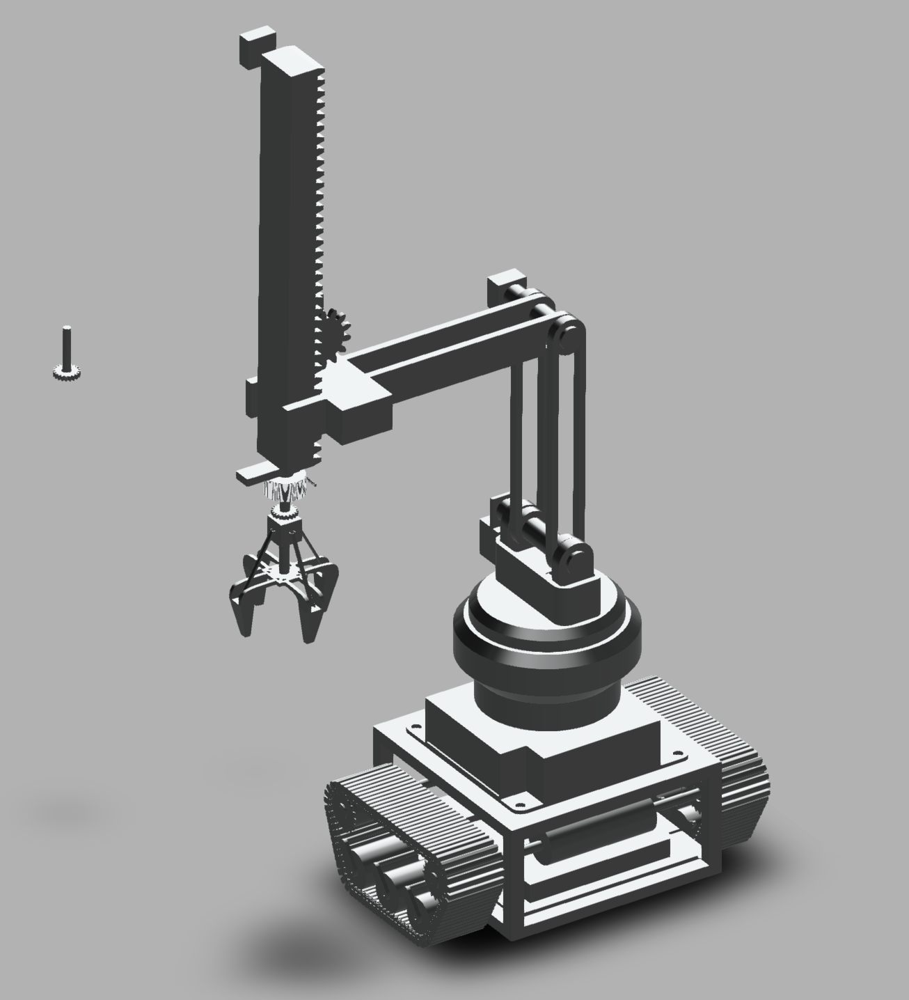
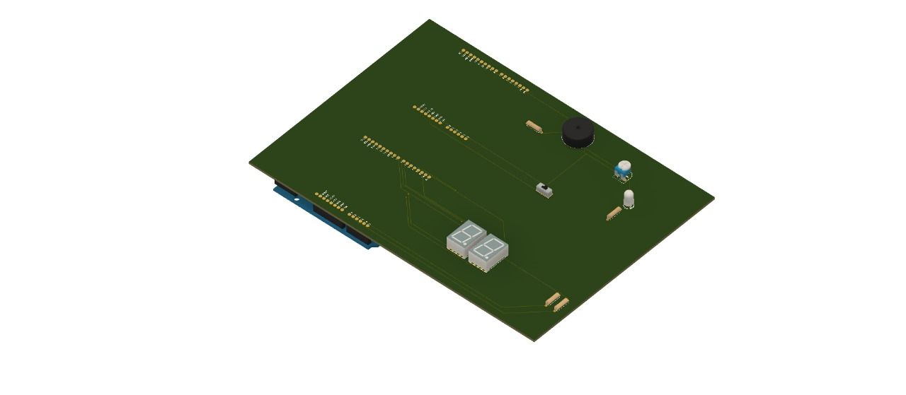
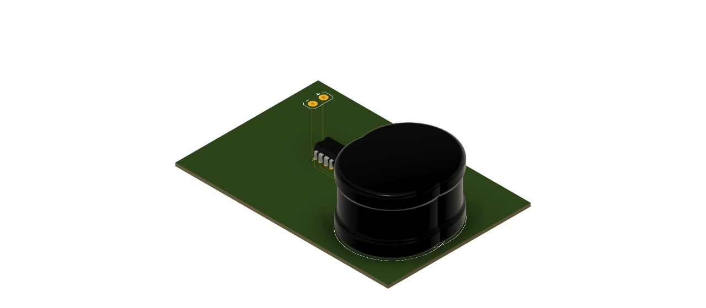
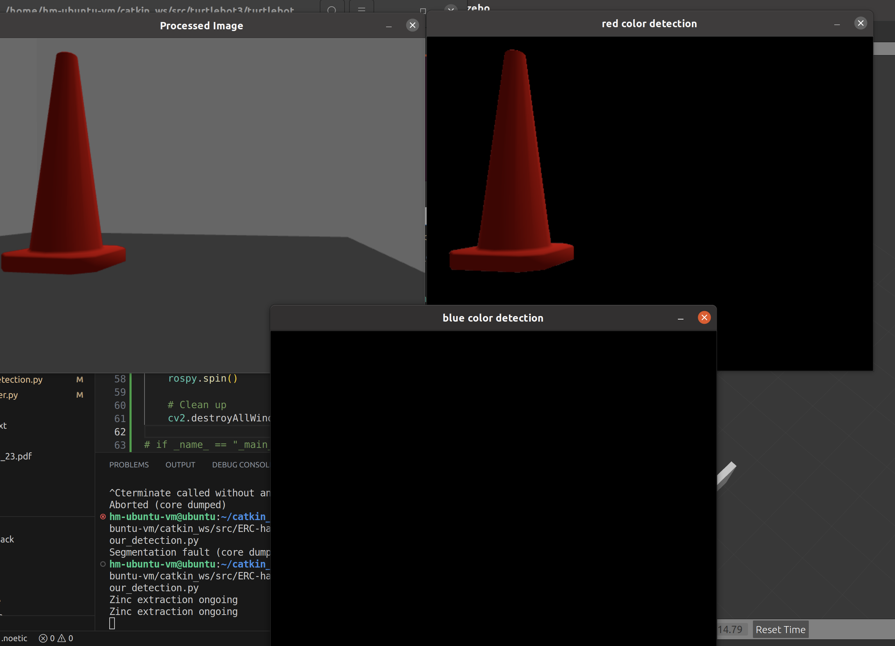
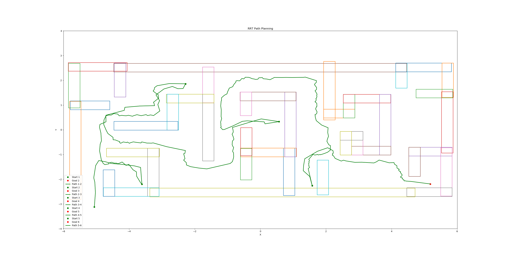

# ERC-Mine-Club-2023

## Mechanical
- Ansys final report -> [link](https://github.com/Harshvardhan-Mestha/ERC-Mine-Club-2023/blob/main/Mechanical/ANSYS_Final_Report.pdf)

- Model render -> [link](https://a360.co//3OTClzP)

- Alternative arm -> [link](https://a360.co/3stdFGF)

## Electronics 
- Four Wheel Drive -> [link](https://www.tinkercad.com/things/5HOjNXjHiFC)

- Metal Detector -> [link](https://www.tinkercad.com/things/5vAegxYcHEg)

- Buzzer -> [link](https://www.tinkercad.com/things/hFF90LCTz0P)

- Mechanism -> [link](https://www.tinkercad.com/things/21VSuojyYMi)

## Automation

- Color Detection -> [link](https://github.com/Harshvardhan-Mestha/ERC-Mine-Club-2023/blob/main/Automation/scripts/colour_detection.py)

- Path Planning -> [link](https://github.com/Harshvardhan-Mestha/ERC-Mine-Club-2023/blob/main/Automation/scripts/path_planner.py)

- Controller -> [link](https://github.com/Harshvardhan-Mestha/ERC-Mine-Club-2023/blob/main/Automation/scripts/controller.py)

## Images
3D model render

Buzzer

Metal Detector

Color Detection

Path Planning
